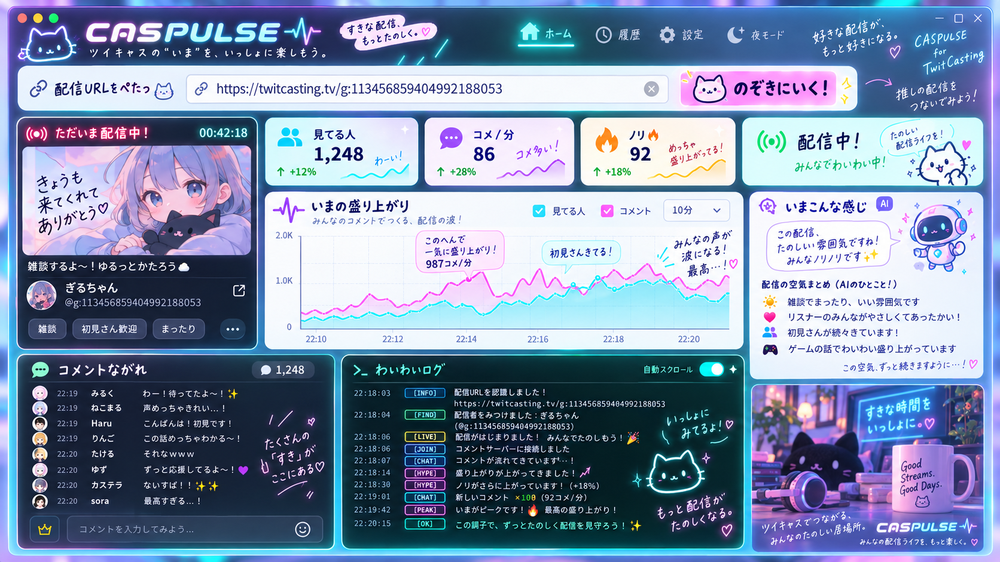

# CASPULSE

> **ツイキャスの“いま”を、いっしょに楽しもう。**

CASPULSE は、TwitCasting配信のURLを貼るだけで、コメント・視聴者数・勢い・配信の流れをひとつの画面で眺められるローカルデスクトップアプリです。

**v0.1.3 — Pop UI / Easy Connect refresh**  
Repository: `Ryohei0Otsuka/caspulse`



> デザインの方向は **ネオン × ポップ × 配信文化**。業務ダッシュボードではなく、配信の横に置いておきたくなる“配信コンパニオン”を目指しています。

---

## 使う人は、これだけ

一般公開版では次の4ステップだけで使える形を目指しています。

```text
CASPULSE-Setup.exe
        ↓
インストール
        ↓
「ツイキャスとつなぐ」  ※初回だけ
        ↓
配信URLをぺたっ
        ↓
「のぞきにいく！」
```

利用者に **npm / GitHub / Client ID / Client Secret / Callback URL** を入力させない設計です。

### 普段の使い方

1. CASPULSEを起動
2. 配信URLをコピー
3. `配信URLをぺたっ` に貼る
4. **のぞきにいく！**

クリップボードにTwitCasting URLが入っていれば、CASPULSE側から **「ツイキャスのURLみつけた！」** と候補を出します。

例：

```text
https://twitcasting.tv/g:113456859404992188053
```

`@screen_id` / `screen_id` の直接入力にも対応しています。

---

## 初回だけ：ツイキャスとつなぐ

公開ビルドではCASPULSE用のTwitCasting **Client IDをアプリ側へ同梱**します。

利用者はClient IDを探したり入力したりせず、初回画面の：

```text
[ ツイキャスとつなぐ ]
```

を押すだけです。

標準ブラウザでTwitCastingの連携確認が開くので、内容を確認して連携を許可します。認証後のAccess Tokenは、利用可能なOSではElectron `safeStorage` を使ってローカル暗号化保存します。

```text
Client ID      = CASPULSE側で用意するアプリ識別ID
Client Secret  = 配布しない / アプリへ入れない
Access Token   = 利用者の認証後に取得 / ローカル暗号化保存
```

CASPULSEが勝手にコメント投稿や配信を行う機能はv0.1.3にはありません。

---

## 配信サムネイル

配信中は、左上の配信カードへ **実際のライブサムネイル** を表示します。

CASPULSEはTwitCasting API v2のLive Thumbnail APIを使い、`large / latest` の画像を一定間隔で更新します。

```text
配信URL
  ↓
配信者 user.id を解決
  ↓
/users/:user_id/live/thumbnail
  ↓
CASPULSE左上へ最新サムネイル表示
```

配信中でない場合は、配信者アイコンと「次の配信まち」表示へ切り替わります。

---

## いまできること

- `https://twitcasting.tv/...` をそのまま入力
- クリップボードのTwitCasting URLを候補表示
- `@screen_id` / `screen_id` の直接入力
- `screen_id` を固定 `user.id` へ解決して追従
- 配信開始・終了を検知
- 現在の `movie_id` を自動追従
- 実ライブサムネイル表示・更新
- コメント取得 / SQLite保存
- コメント投稿者の `screen_id` と固定 `user.id` を保存
- **見てる人 / コメ・分 / 勢い / いま** の4カード
- **いまの盛り上がり** グラフ
- **コメントながれ**
- **わいわいログ**
- コメント読み上げ
- 最近つないだ配信
- Access Tokenのローカル暗号化保存

データ取得はTwitCasting API v2を使い、Webページの無許可スクレイピングは行いません。

---

## UI方針

CASPULSE v0.1.3では、HTML CanvasにUI全体を描く方式にはしていません。

通常のReact DOM + CSSで構築しています。理由は、入力フォーム・コメントリスト・スクロール・アクセシビリティ・レスポンシブを保ったまま、実際に操作できるUIとしてモックの雰囲気へ寄せるためです。

現在の演出：

- ネオンのカード枠
- ステッカー風カード
- 手書き風ひとこと
- LIVE発光
- 配信サムネイルの軽いシマー
- グラフの吹き出し
- コメントのホバー
- ターミナル風 `わいわいログ`
- CASPULSEマスコット / アプリアイコン

将来、波形・パーティクル・音声ビジュアライザーなどで必要になればCanvasを限定的に追加します。

---

## 「勢い」と「ノリ」

### 勢い

直近15秒のコメント量を、その前60秒から作った基準と比べる短期変化率です。

```text
直近 = 最新15秒のコメント数
基準 = その前60秒のコメント数 ÷ 4
勢い = (直近 - 基準) / 基準 × 100
```

表示上は `-100%` 〜 `+999%` に収めます。

### ノリ

コメント数、参加人数、視聴者の増加、正方向の勢いを混ぜた **0〜100の実験スコア** です。

これは「この話題がウケた」と原因を断定する値ではありません。おすすめ掲載、SNS流入、他配信の終了など、CASPULSEから見えない外的要因があります。

`いまこんな感じ` もv0.1.3では実測値から短いひとことを作るだけで、AI文脈解析ではありません。

詳しくは [`docs/METRICS.md`](docs/METRICS.md)。

---

# 開発者向け

ここから下は、RepositoryをCloneして開発する人向けです。一般利用者向けSetup.exeでは不要です。

## 必要なもの

- Windows 10 / 11
- Node.js `20.19+` または `22.12+`（Node 24推奨）
- npm
- TwitCasting Developer App

Desktop runtime は Electron `44.2.0` を固定しています。

## 1. Clone / Install

```powershell
cd "C:\Users\Ryohei\Documents\GitHub\caspulse"
npm install
```

---

## 2. 開発ビルドにClient IDを設定

TwitCasting DeveloperでCASPULSE用Appを登録します。

Callback URL：

```text
http://127.0.0.1:47831/oauth/callback
```

Repository直下で `.env.example` を参考に `.env.local` を作成します。

```env
CASPULSE_TWITCASTING_CLIENT_ID=あなたのClientID
```

**Client Secretは書かないでください。**

`.env.local` はGit管理対象外です。

`npm run dev` / `npm run build` の前に `scripts/generate-oauth-config.mjs` が自動実行され、このClient IDだけを開発ビルドへ埋め込みます。

v0.1.2までにCASPULSEの設定画面からClient IDを保存していた開発環境は、移行互換としてその値も利用できます。埋め込みClient IDがある場合はそちらを優先します。

---

## 3. 開発起動

```powershell
npm run dev
```

Client ID未設定のソースビルドでは、一般利用者向けのClient ID入力欄は出さず、開発者向けセットアップ案内のみ表示します。

---

## 4. 型チェック / Build

```powershell
npm run typecheck
npm run build
```

Windows配布物：

```powershell
npm run dist:win
```

想定成果物：

```text
release/
├─ CASPULSE-Setup-0.1.3-x64.exe
└─ CASPULSE-Portable-0.1.3-x64.exe
```

Setup版を一般利用者向けのメイン配布物とします。

---

## 認証設計

CASPULSEはTwitCasting API v2のImplicit OAuthを利用します。

```text
CASPULSE
  ↓ Client ID
TwitCasting OAuth
  ↓ 利用者が許可
http://127.0.0.1:47831/oauth/callback
  ↓ URL fragmentからAccess Token受取
CASPULSE
  ↓
safeStorage
```

Client SecretをElectronアプリへ埋め込まない構成です。

---

## ローカルデータ

DBは Electron側のNode `node:sqlite` を利用します。

主なデータ：

- tracked users
- stream sessions
- comments
- stream metrics
- settings / encrypted token payload

ユーザーデータディレクトリ配下へ保存し、Repositoryへはコミットしません。

---

## Roadmap

### v0.2

- 配信履歴
- MOMENT / AUTO MOMENT
- コメント検索 / ユーザー追跡の強化
- グラフ区間クリック

### v0.3

- 配信音声のローカル録音（権利・許可を前提）
- コメントと音声タイムライン同期
- TTSの声 / 速度 / NG設定

### v0.4

- 音声文字起こし
- 配信者発話 + コメント文脈サマリー
- 話題区間抽出
- AUTO MOMENT高度化

---

## Privacy / Safety

- Client SecretをRepositoryへ置かない
- Access TokenをRepositoryへ置かない
- `.env.local` はGit管理対象外
- ログは原則ローカル保存
- 第三者配信の録音機能を追加する場合は、配信者の権利・著作権・利用条件を確認する
- 原因を確認できない視聴者増加を「この発言が原因」と断定しない

---

## License

MIT License. See [`LICENSE`](LICENSE).
