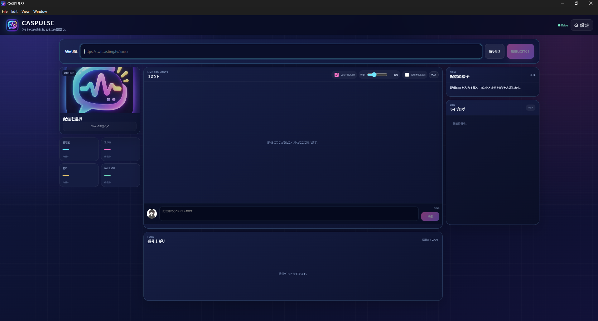

# CASPULSE

**ツイキャスの流れを、ひとつの画面で。**

CASPULSE は、配信URLを貼るだけでコメント・視聴者数・勢い・盛り上がりを確認できる **Windows向けポータブルアプリ** です。

## ✦ 使い方

1. [Releases](../../releases) から Windows版ZIPをダウンロード
2. ZIPを解凍して `CASPULSE.exe` を起動
3. ツイキャスの配信URLを貼って **「視聴しに行く！」**

**インストール・アカウント登録・Client ID設定は不要です。**

## ✦ できること

- 💬 リアルタイムコメント
- 👀 視聴者数
- ⚡ 勢い / 盛り上がり
- 🧭 LIVE SUMMARY（配信の流れを短く整理）
- 📈 推移グラフ
- 🔊 コメント読み上げ（音量・速度調整 / テスト再生）
- 🖼️ 配信サムネイル
- ✍️ CASPULSEからコメント投稿（任意のツイキャス連携）
- 🔌 配信からの明示的な切断
- 🗂️ コメント・履歴のローカル保存

閲覧だけならツイキャス連携は不要です。  
コメントを投稿するときだけ、ツイキャスの連携画面を使用します。

## ✦ 動作環境

**Windows 10 / 11 64-bit**  
インターネット接続が必要です。

## ✦ データについて

コメント履歴や盛り上がりデータは、基本的に **あなたのPC内** に保存されます。

コメント投稿用のアクセストークンもローカルで扱い、CASPULSE Relayには送信しません。

## License

MIT License
